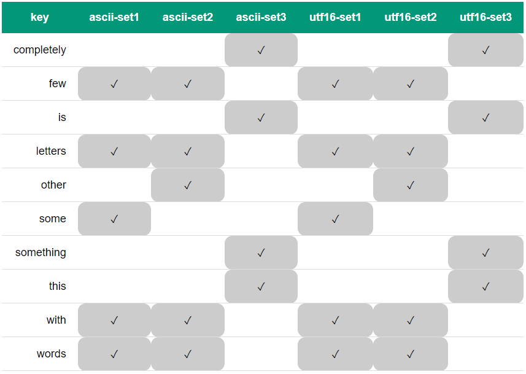

# sets-matcher

Python tool for matching sets of strings into tables. This is really ad hoc tool, so don't expect too much.

## install

```
pip install git+https://github.com/streanger/sets-matcher.git
```

## usage (cli)

```
usage: __main__.py [-h] [--verbose] [--output OUTPUT] [--format {csv,md,html,xlsx}] files [files ...]

+----------------------------------------------------+
|                    sets-matcher                    |
|----------------------------------------------------|
| version: 0.2.0                                     |
|    home: https://github.com/streanger/sets-matcher |
+----------------------------------------------------+

positional arguments:
  files

options:
  -h, --help            show this help message and exit
  --verbose, -v
  --output OUTPUT, -o OUTPUT
  --format {csv,md,html,xlsx}, -f {csv,md,html,xlsx}
```

```
matcher --format md --output out.md set1.txt set2.txt set3.txt
matcher --format csv --output out.csv *.txt
matcher --output out.html *.txt
matcher --output out.xlsx *.txt
```

## usage (python)

```python
from rich import print
from sets_matcher import match_sets, to_markdown, to_rich_table

example_sets_with_names = [
    ('set1', {'some', 'words', 'with', 'few', 'letters'}),
    ('set2', {'other', 'words', 'with', 'few', 'letters'}),
    ('set3', {'this', 'is', 'something', 'completely'}),
    ('set4', {'almost', 'last', 'one', 'with', 'few', 'letters'}),
    ('set5', {'last', 'some', 'matches', 'above', 'words'}),
    ('set6', {'then', 'put', 'here', 'words'}),
]

header, table = match_sets(example_sets_with_names)
md = to_markdown(header, table)
Path('out.md').write_text(md)

rich_table = to_rich_table(header, table)
print(rich_table)
```

## screenshots




## changelog

- `0.2.0` - `to_xlsx` function
- `0.1.9` - `index_column` param in `to_html` function
- `0.1.8` - a little o typing, rich logging, few fixes
- `0.1.7` - html header top sticky, cli - guess format based on output suffix, checkmark in md export, termcolor removed from dependencies
- `0.1.6` - sortable html table
- `...`
- `0.1.0` - initial release
